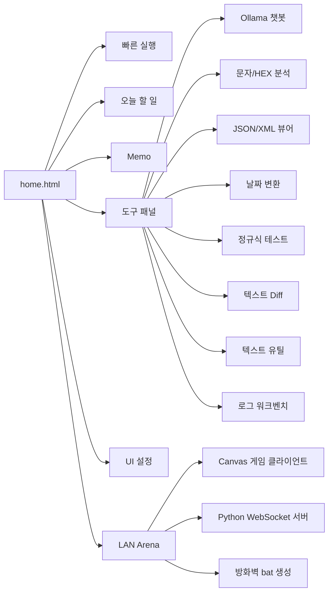

# Good_ETC


브라우저에서 바로 쓰는 개인 업무 대시보드입니다. 즐겨찾기, 할 일, 메모, 로그 분석, JSON/XML 보기, 문자/HEX 분석, 텍스트 유틸, Diff, 정규식 테스트, Ollama 챗봇, 같은 LAN에서 즐기는 탑다운 아레나 게임을 함께 제공합니다.

## 화면 구성



## 주요 기능

| 영역       | 기능            | 설명                                                                                                             |
| ---------- | --------------- | ---------------------------------------------------------------------------------------------------------------- |
| 빠른 실행  | 즐겨찾기 관리   | 자주 쓰는 사이트를 카드로 등록하고, 이름/URL/별칭/Font Awesome 아이콘을 수정할 수 있습니다.                      |
| 빠른 실행  | 명령 팔레트     | `Ctrl + K`로 URL, IP, Redmine 이슈, Google/Naver 검색, TODO, 메모, 도구 실행, UUID/Base64/URL 변환을 처리합니다. |
| 오늘 할 일 | 체크리스트      | 할 일을 추가하고 완료 체크, 마감일, 우선순위, 삭제, 진행률 확인을 할 수 있습니다.                                |
| Memo       | 다중 메모       | 여러 메모를 만들고 제목/내용 검색, 자동 저장, 다운로드, 체크리스트 삽입, 시간 삽입, 백업을 지원합니다.           |
| 도구 패널  | Ollama 챗봇     | API 주소와 모델명을 설정해 로컬/사내 Ollama 서버와 대화할 수 있습니다. Markdown 응답 표시를 지원합니다.          |
| 도구 패널  | 문자/HEX 분석기 | 문자 코드, HEX 바이트, Decimal, ASCII, Checksum, UInt16/UInt32 값을 확인합니다.                                  |
| 도구 패널  | 필드 분리       | `Header:2, Length:1, Cmd:1, Payload:*, CRC:2` 같은 스펙으로 HEX 패킷 필드를 나눠 봅니다.                         |
| 도구 패널  | JSON/XML 뷰어   | JSON/XML 파싱, 포맷팅, 경로 탐색, 키/값/태그 검색, 복사/다운로드를 지원합니다.                                   |
| 도구 패널  | 날짜 변환       | Unix Timestamp(ms) 또는 날짜 문자열을 로컬 시간과 ISO 형식으로 변환합니다.                                       |
| 도구 패널  | 정규식 테스트   | 패턴과 원문을 넣고 매칭 결과를 바로 확인합니다.                                                                  |
| 도구 패널  | 텍스트 비교     | 원본/비교 텍스트의 차이를 Diff 형태로 확인하고 결과를 복사/다운로드합니다.                                       |
| 도구 패널  | 텍스트 유틸     | Base64, URL 인코딩/디코딩, JWT 디코드, CSV/TSV 표 보기를 지원합니다.                                             |
| 도구 패널  | 로그 워크벤치   | 로그 필터링, 패턴 집계, 타임라인 분석, 고유 줄 복사, 오류 해결 사전 적용을 제공합니다.                           |
| 도구 패널  | LAN 아레나      | 같은 LAN 사용자가 접속하는 탑다운 실시간 아레나 게임 실행과 방화벽 bat 생성을 지원합니다.                        |
| UI 설정    | 개인화          | Light/Dark 테마, 글자 크기, 레이아웃, 섹션 표시/접기, 프리셋 저장, 설정 내보내기/가져오기를 지원합니다.          |

## 빠른 시작

가장 단순한 사용 방식은 `home.html` 파일 하나만 다운로드해서 브라우저로 여는 것입니다. 즐겨찾기, TODO, 메모, UI 설정 같은 개인 데이터는 서버가 아니라 브라우저 `localStorage`에 저장됩니다.

```text
home.html
```

대시보드만 실행하려면 Nginx 컨테이너만 올리면 됩니다.

```bash
git clone git@github.com:kjsu1994/Good_ETC.git
cd Good_ETC
cp .env.example .env
docker compose up -d web-server
```

브라우저에서 접속합니다.

```text
http://localhost:8081/home.html
```

MinIO와 Oracle XE까지 함께 쓰려면 전체 서비스를 실행합니다.

```bash
docker compose up -d
```

## LAN 아레나 게임

게임은 `game/` 폴더의 HTML/CSS/JS 클라이언트와 Python WebSocket 서버로 구성됩니다. 별도 Python 패키지 설치 없이 표준 라이브러리만 사용합니다.

호스트 PC에서 서버를 실행합니다.

```bash
python game/server.py --host 0.0.0.0 --port 7000
```

호스트는 아래 주소로 게임을 엽니다.

```text
http://localhost:7000/
```

같은 LAN 사용자는 호스트 PC의 IP로 접속합니다.

```text
http://HOST_IP:7000/
```

Windows 방화벽에서 TCP `7000` 포트가 막혀 있으면 접속할 수 없습니다. `home.html`의 LAN 아레나 패널에서 접속을 허용할 원격 IP와 포트를 입력하면 관리자 권한으로 실행할 `.bat` 내용을 생성하거나 다운로드할 수 있습니다. 브라우저 보안상 `home.html`은 방화벽 규칙을 직접 적용하지 않습니다.

Windows PC에서 같은 LAN 사용자를 받으려면 서버 프로세스가 Windows 네트워크 인터페이스에 열려 있어야 합니다. WSL에서 서버를 실행했는데 외부 PC가 접속하지 못하면 Windows Python 또는 향후 EXE 런처로 실행하거나 WSL 포트 전달 설정을 확인하세요.

### Windows 단일 EXE 런처

`pyluncher/`에는 `home.html`과 `game/`을 단일 Windows EXE로 묶는 Python 런처가 있습니다. 빌드된 EXE를 실행하면 로컬 서버가 시작되고 브라우저에서 `home.html`이 열립니다.

```powershell
powershell -ExecutionPolicy Bypass -File .\pyluncher\build.ps1
```

빌드 결과:

```text
pyluncher/dist/GoodETC_Launcher.exe
```

EXE는 기본적으로 `0.0.0.0:7000`에 서버를 열므로 같은 LAN 사용자도 방화벽 허용 후 접속할 수 있습니다.

## Docker 서비스

| 서비스       | 포트                     | 용도                                                                                                       |
| ------------ | ------------------------ | ---------------------------------------------------------------------------------------------------------- |
| `web-server` | `8081:80`                | `home.html`을 Nginx로 서빙합니다.                                                                          |
| `minio`      | `9000:9000`, `9001:9001` | S3 호환 오브젝트 스토리지와 콘솔을 제공합니다.                                                             |
| `oracle`     | `1522:1521`              | Oracle XE 21c 컨테이너입니다. 컨테이너 내부 접속 문자열은 `jdbc:oracle:thin:@//oracle:1521/XEPDB1` 입니다. |

## 환경 변수

`.env.example`을 `.env`로 복사한 뒤 값을 채워 사용합니다.

| 변수                  | 설명                                |
| --------------------- | ----------------------------------- |
| `MINIO_ROOT_USER`     | MinIO 관리자 계정                   |
| `MINIO_ROOT_PASSWORD` | MinIO 관리자 비밀번호               |
| `ORACLE_PASSWORD`     | Oracle 관리자 비밀번호              |
| `APP_USER`            | Oracle 애플리케이션 사용자          |
| `APP_USER_PASSWORD`   | Oracle 애플리케이션 사용자 비밀번호 |

`.env`는 개인 환경 정보이므로 Git에 올리지 않습니다.

## 명령 팔레트 예시

`Ctrl + K`를 누른 뒤 아래처럼 입력할 수 있습니다.

| 입력 예시                                                             | 동작                                   |
| --------------------------------------------------------------------- | -------------------------------------- |
| `https://example.com`                                                 | URL을 새 탭으로 엽니다.                |
| `192.168.1.10:8080`                                                   | IP 주소를 `http://`로 열어 봅니다.     |
| `#1234` 또는 `redmine 1234`                                           | Redmine 이슈 페이지로 이동합니다.      |
| `google docker compose` 또는 `g docker compose`                       | Google 검색을 실행합니다.              |
| `naver 오라클 XE` 또는 `n 오라클 XE`                                  | Naver 검색을 실행합니다.               |
| `todo 보고서 작성`                                                    | 오늘 할 일에 항목을 추가합니다.        |
| `memo 회의록`                                                         | 새 메모를 만듭니다.                    |
| `uuid`, `timestamp`                                                   | 값을 생성해 클립보드에 복사합니다.     |
| `base64 hello`, `b64d aGVsbG8=`, `urlencode a=b`, `urldecode a%3Db`   | 텍스트를 변환해 클립보드에 복사합니다. |
| `json`, `log`, `diff`, `regex`, `date`, `hex`, `text`, `game`, `chat` | 해당 도구 패널을 바로 엽니다.          |

## 단축키

| 단축키                 | 동작                         |
| ---------------------- | ---------------------------- |
| `Ctrl + K` / `Cmd + K` | 명령 팔레트 열기             |
| `Alt + S`              | 검색/빠른 실행 입력창 포커스 |
| `Alt + N`              | 새 메모 만들기               |
| `Alt + T`              | 도구 패널 열기               |
| `Alt + U`              | UI 설정 열기                 |
| `Alt + Q`              | Ollama 챗봇 열기             |
| `Esc`                  | 열린 패널/모달 닫기          |

## 데이터 저장 방식

대시보드의 즐겨찾기, TODO, 메모, UI 설정은 브라우저 `localStorage`에 저장됩니다.

| 항목     | 저장 위치             | 참고                                                     |
| -------- | --------------------- | -------------------------------------------------------- |
| 즐겨찾기 | 브라우저 localStorage | 브라우저나 프로필이 바뀌면 별도로 옮겨야 합니다.         |
| TODO     | 브라우저 localStorage | 같은 브라우저에서 자동 유지됩니다.                       |
| Memo     | 브라우저 localStorage | 백업/다운로드 기능으로 별도 보관할 수 있습니다.          |
| UI 설정  | 브라우저 localStorage | UI 설정 패널에서 내보내기/가져오기를 사용할 수 있습니다. |

## 파일 구성

```text
.
├── home.html                  # 메인 대시보드 단일 페이지
├── game/                      # LAN 아레나 게임 클라이언트와 Python 서버
│   ├── index.html
│   ├── style.css
│   ├── game.js
│   ├── server.py
│   └── README.md
├── pyluncher/                 # home.html과 game/을 단일 Windows EXE로 묶는 런처
│   ├── launcher.py
│   ├── build.ps1
│   ├── README.md
│   └── dist/
│       └── GoodETC_Launcher.exe
├── docker-compose.yml          # Nginx, MinIO, Oracle XE 실행 구성
├── package.json                # 포맷/검증 스크립트
├── tools/
│   ├── prettier.cjs            # Prettier 실행 래퍼
│   └── validate-home.cjs       # home.html 정적 검증 스크립트
├── .env.example                # 환경 변수 예시
├── error_knowledge_base.json   # 로그 워크벤치 오류 해결 사전
├── must.md                     # 작업 메모/요구사항 기록
└── oracle-data/                # Oracle 데이터 볼륨
```

## 유지보수

기능을 수정한 뒤에는 아래 검사를 실행합니다. `validate`는 `home.html`의 스크립트 문법, 필수 DOM ID, 주요 이벤트 연결 속성, `localStorage` 키 존재 여부를 확인합니다.

```bash
npm run validate
npm run format:check
```

포맷을 맞출 때는 아래 명령을 사용합니다.

```bash
npm run format
```

리팩터링 원칙:

- 대시보드 본체는 `home.html` 단일 파일 구조를 유지합니다.
- LAN 아레나처럼 별도 런타임이 필요한 기능은 하위 폴더에 분리하되, `home.html`에서 실행 진입점을 제공합니다.
- `package.json`과 `tools/`는 개발/검증용 보조 파일입니다.
- 기존 DOM ID와 `localStorage` 키 값은 사용자 데이터 호환성을 위해 함부로 바꾸지 않습니다.
- 새 저장 데이터가 필요하면 `STORAGE_KEYS`에 키를 먼저 추가하고, 사용자가 이해해야 하는 변경은 README에 함께 반영합니다.
- `x2p`, `x12`처럼 짧은 ID를 직접 바꾸기보다 `ELEMENT_IDS` 같은 의미 있는 별칭을 먼저 추가합니다.
- 기능별 정리는 파일 분리가 아니라 `home.html` 내부 주석과 의미 있는 함수/상수 이름부터 적용합니다.

## 사용 팁

- 즐겨찾기 별칭을 등록하면 명령 팔레트에서 별칭만 입력해도 링크를 열 수 있습니다.
- 각 기능의 `?` 버튼을 누르면 해당 기능의 입력 방식과 주의사항을 바로 확인할 수 있습니다.
- LAN 아레나는 호스트가 `python game/server.py --host 0.0.0.0 --port 7000`을 실행한 뒤 같은 망 사용자가 접속하는 방식입니다.
- 게임 접속이 안 되면 호스트 IP, 포트, Windows 방화벽 인바운드 규칙을 먼저 확인하세요.
- TODO는 마감일과 우선순위를 저장하며, 지난 마감일과 오늘 마감 항목을 색으로 구분합니다.
- 메모 검색은 제목뿐 아니라 메모 내용까지 함께 찾습니다.
- HEX 분석기의 필드 분리에서 `*`는 남은 바이트 전체를 의미합니다.
- 텍스트 유틸은 Base64/URL 변환, JWT Header/Payload 확인, CSV/TSV 표 보기에 사용할 수 있습니다.
- 로그 워크벤치는 `ERROR`, `WARN`, `INFO` 스타일 로그를 빠르게 분류하고, 키워드별 빈도와 시간 간격을 확인하는 용도에 적합합니다.
- Ollama 챗봇은 브라우저에서 접근 가능한 API 주소가 필요합니다. 사내망/로컬망 주소를 사용할 경우 CORS와 네트워크 접근 권한을 확인하세요.

## 운영 참고

- 대시보드 본체인 `home.html`은 단일 정적 파일이라 별도 빌드 과정 없이 Nginx, 파일 서버, 브라우저 직접 열기 방식으로 사용할 수 있습니다.
- GitHub ZIP 전체를 내려받으면 LAN 아레나를 포함한 전체 기능을 사용할 수 있습니다. 대시보드만 필요하면 `home.html`만 열어도 됩니다.
- 기본 즐겨찾기에는 내부망 주소가 포함되어 있으므로 사용 환경에 맞게 수정해서 쓰는 것을 권장합니다.
- 개인 데이터는 서버가 아니라 브라우저에 저장됩니다. PC 교체나 브라우저 초기화 전에는 설정과 메모를 내보내거나 백업하세요.
