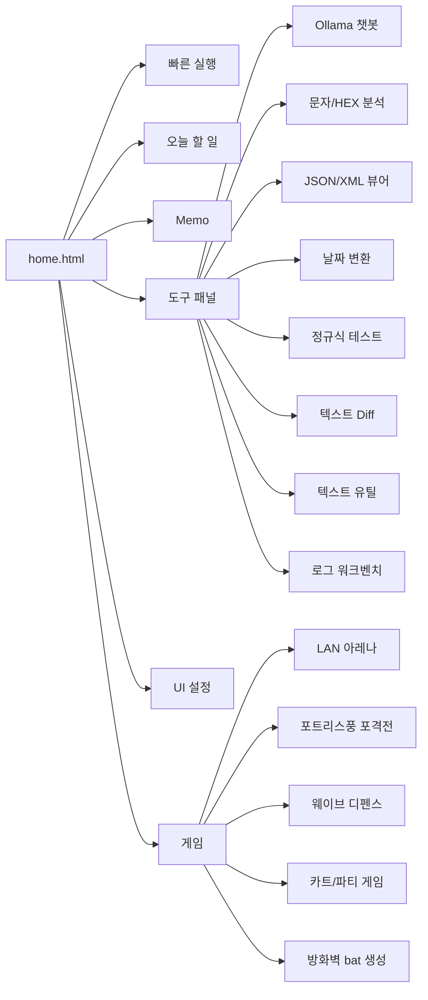

# Good_ETC


브라우저에서 바로 쓰는 개인 업무 대시보드입니다. 즐겨찾기, 할 일, 메모, 로그 분석, JSON/XML 보기, 문자/HEX 분석, 텍스트 유틸, Diff, 정규식 테스트, Ollama 챗봇, LAN 아레나와 포트리스풍 포격전, 웨이브 디펜스, 카트 랠리와 파티 게임 3종을 함께 제공합니다.

## 화면 구성



## 주요 기능

| 영역       | 기능            | 설명                                                                                                                                                                     |
| ---------- | --------------- | ------------------------------------------------------------------------------------------------------------------------------------------------------------------------ |
| 빠른 실행  | 즐겨찾기 관리   | 자주 쓰는 사이트를 카드로 등록하고, 이름/URL/별칭/Font Awesome 아이콘을 수정할 수 있습니다.                                                                              |
| 빠른 실행  | 명령 팔레트     | `Ctrl + K`로 URL, IP, Redmine 이슈, Google/Naver 검색, TODO, 메모, 도구 실행, UUID/Base64/URL 변환을 처리합니다.                                                         |
| 오늘 할 일 | 체크리스트      | 할 일을 추가하고 완료 체크, 마감일, 우선순위, 삭제, 진행률 확인을 할 수 있습니다.                                                                                        |
| Memo       | 다중 메모       | 여러 메모를 만들고 제목/내용 검색, 자동 저장, 다운로드, 체크리스트 삽입, 시간 삽입, 백업을 지원합니다.                                                                   |
| 도구 패널  | Ollama 챗봇     | API 주소와 모델명을 설정해 로컬/사내 Ollama 서버와 대화할 수 있습니다. Markdown 응답 표시를 지원합니다.                                                                  |
| 도구 패널  | 문자/HEX 분석기 | 문자 코드, HEX 바이트, Decimal, ASCII, Checksum, UInt16/UInt32 값을 확인합니다.                                                                                          |
| 도구 패널  | 필드 분리       | `Header:2, Length:1, Cmd:1, Payload:*, CRC:2` 같은 스펙으로 HEX 패킷 필드를 나눠 봅니다.                                                                                 |
| 도구 패널  | JSON/XML 뷰어   | JSON/XML 파싱, 포맷팅, 경로 탐색, 키/값/태그 검색, 복사/다운로드를 지원합니다.                                                                                           |
| 도구 패널  | 날짜 변환       | Unix Timestamp(ms) 또는 날짜 문자열을 로컬 시간과 ISO 형식으로 변환합니다.                                                                                               |
| 도구 패널  | 정규식 테스트   | 패턴과 원문을 넣고 매칭 결과를 바로 확인합니다.                                                                                                                          |
| 도구 패널  | 텍스트 비교     | 원본/비교 텍스트의 차이를 Diff 형태로 확인하고 결과를 복사/다운로드합니다.                                                                                               |
| 도구 패널  | 텍스트 유틸     | Base64, URL 인코딩/디코딩, JWT 디코드, CSV/TSV 표 보기를 지원합니다.                                                                                                     |
| 도구 패널  | 로그 워크벤치   | 로그 필터링, 패턴 집계, 타임라인 분석, 고유 줄 복사, 오류 해결 사전 적용을 제공합니다.                                                                                   |
| 도구 패널  | 게임            | LAN 아레나, 포트리스풍 포격전, 웨이브 디펜스, 카트 랠리, 폭탄 그리드, 스네이크 배틀, 코인 러시를 지원하며, 선택한 게임에 따라 호스트/입장하기 버튼이 해당 게임을 엽니다. |
| UI 설정    | 개인화          | Light/Dark 테마, 글자 크기, 레이아웃, 섹션 표시/접기, 프리셋 저장, 설정 내보내기/가져오기를 지원합니다.                                                                  |

## 빠른 시작

가장 단순한 사용 방식은 `home.html` 파일 하나만 다운로드해서 브라우저로 여는 것입니다. 즐겨찾기, TODO, 메모, UI 설정 같은 개인 데이터는 서버가 아니라 브라우저 `localStorage`에 저장됩니다.

```text
home.html
```

대시보드와 LAN 게임 서버를 실행하려면 Nginx 컨테이너를 올리면 됩니다. `web-server`가 `game-server`를 함께 시작합니다.

```bash
git clone git@github.com:kjsu1994/Good_ETC.git
cd Good_ETC
cp .env.example .env
docker compose up -d web-server
```

브라우저에서 접속합니다.

```text
http://localhost:8085/home.html
```

MinIO와 Oracle XE까지 함께 쓰려면 전체 서비스를 실행합니다.

```bash
docker compose up -d
```

## 게임

`home.html`의 게임 패널은 탭으로 게임을 선택합니다. `LAN 아레나`는 기존 LAN 실시간 게임이고, `포트리스`, `웨이브 디펜스`, `카트 랠리`, `폭탄 그리드`, `스네이크 배틀`, `코인 러시`는 WebSocket 멀티 모드와 혼자하기 로컬 모드를 함께 제공합니다. 호스트 IP, 포트, 방화벽 bat 생성 영역은 게임 탭 아래에 공통으로 표시됩니다.

통합 입장 센터에서는 같은 `/hub` 연결로 열린 게임 방을 만들고 참가할 수 있습니다. 게임 방을 만들면 만든 사람은 바로 게임 화면으로 들어가며, 다른 사용자는 통합 입장 센터 방 목록의 `입장` 또는 `관전하기` 버튼이나 공유 링크로 참가합니다. `입장 센터 초대`는 방 목록과 상태를 먼저 보여주는 링크를 복사하고, `바로 입장`은 선택한 게임 화면을 즉시 엽니다.

### LAN 아레나

게임은 `game/` 폴더의 HTML/CSS/JS 클라이언트와 Python WebSocket 서버로 구성됩니다. 별도 Python 패키지 설치 없이 표준 라이브러리만 사용합니다.

호스트 PC에서 서버를 실행합니다.

```bash
python game/server.py --host 0.0.0.0 --port 7000
```

호스트는 아래 주소로 게임을 엽니다.

```text
http://localhost:7000/
```

같은 LAN 사용자는 호스트 PC의 IP로 접속합니다.

```text
http://HOST_IP:7000/
```

Windows 방화벽에서 TCP `7000` 포트가 막혀 있으면 접속할 수 없습니다. `home.html`의 LAN 아레나 패널에서 접속을 허용할 원격 IP와 포트를 입력하면 관리자 권한으로 실행할 `.bat` 내용을 생성하거나 다운로드할 수 있습니다. 브라우저 보안상 `home.html`은 방화벽 규칙을 직접 적용하지 않습니다.

Windows PC에서 같은 LAN 사용자를 받으려면 서버 프로세스가 Windows 네트워크 인터페이스에 열려 있어야 합니다. WSL에서 서버를 실행했는데 외부 PC가 접속하지 못하면 Windows Python 또는 향후 EXE 런처로 실행하거나 WSL 포트 전달 설정을 확인하세요.

일반 브라우저에서 `home.html`을 여는 경우 `호스트`와 `입장하기`는 모두 현재 대시보드와 같은 서버의 `game/index.html` 클라이언트를 열고, 입력한 호스트/포트를 WebSocket 접속 주소로 전달합니다. `호스트`는 자동 접속까지 시도하므로 Docker Compose의 `game-server` 또는 별도 `python game/server.py` 서버가 실행 중이어야 합니다. EXE에서는 `호스트`가 런처가 제공하는 게임 클라이언트로 연결됩니다.

게임 클라이언트는 연결에 성공하면 좌상단 연결 패널을 자동으로 접어 게임 화면을 넓게 보여주고, 같은 위치의 토글 버튼으로 다시 펼칠 수 있습니다.

### 포트리스풍 포격전

`포트리스` 탭의 `포트리스 호스트`와 `포트리스 입장하기`는 `ws://호스트:포트/fortress` WebSocket에 접속하는 멀티 모드입니다. 방별 접속에는 `room` 값이 붙으며, 같은 방의 P1/P2만 서로 플레이합니다. 3번째 이후 접속자는 관전자로 들어가고 화면에 관전 상태가 표시됩니다. 플레이어가 나가면 오래된 관전자부터 빈 P1/P2 슬롯으로 자동 참여합니다.

`포트리스 혼자하기`는 서버 접속 없이 같은 PC에서 P1/P2를 번갈아 조작하는 로컬 모드입니다. `←/→`로 이동, `↑/↓`로 포각, `A/D`로 파워를 조절하고 `Space`로 발사합니다. 각 턴에는 이동 게이지가 100 지급되며 좌/우 이동마다 10씩 소모됩니다. `Z/X/C/V/B`로 표준탄, 강타탄, 광역탄, 분열탄, 굴착탄을 선택할 수 있고, `수리(1)`, `보호막(2)`, `강화탄(3)` 아이템을 지원합니다. 독자 레트로 차량, 지형, HUD, 폭발 효과를 Canvas/CSS로 그리며 원작 포트리스2 자산이나 고유 캐릭터는 사용하지 않습니다.

### 웨이브 디펜스

`웨이브 디펜스`는 레트로 픽셀풍 타워 디펜스입니다. 기본 우회로, 항구 지그재그, 용암 협곡 중 맵을 고른 뒤 경로가 아닌 칸에 기본탄, 감속, 폭발, 저격, 증폭기 타워를 배치하고 15웨이브 동안 기지를 지키면 승리합니다.

멀티 모드는 `ws://호스트:포트/defense` WebSocket을 사용합니다. 통합 입장 센터에서 만든 방은 `room` query로 분리되며, 참가자 수 제한 없이 1명부터 4명 이상까지 같은 방에서 플레이할 수 있습니다. 첫 접속자가 방장이며 1웨이브 시작 전 타워 배치 전까지 맵을 바꿀 수 있고, 첫 웨이브 이후에는 준비 시간이 끝나면 다음 웨이브가 자동으로 시작됩니다. 방장이 나가면 가장 오래된 참가자가 방장이 됩니다. 자원은 개인별로 관리되며 자신의 타워만 업그레이드/판매할 수 있습니다.

`디펜스 혼자하기`는 서버 접속 없이 현재 브라우저 또는 EXE 안에서 실행되는 로컬 모드입니다.

### 카트 랠리와 파티 게임

`카트 랠리`, `폭탄 그리드`, `스네이크 배틀`, `코인 러시`는 공통 `/party` WebSocket을 사용하는 신규 파티 게임입니다. 통합 입장 센터에서 각각 `kart`, `bomb`, `snake`, `coin` 방으로 만들 수 있고, 실제 게임 주소는 `game/index.html?game=kart&mode=multi&room=ABCDE`처럼 게임 타입을 query로 구분합니다.

`카트 랠리`는 체크포인트를 따라 3바퀴를 완주하는 레트로 탑다운 레이싱입니다. `폭탄 그리드`는 폭탄 설치와 회피를 중심으로 점수를 얻고, `스네이크 배틀`은 먹이를 모아 길어지며 벽과 꼬리를 피합니다. `코인 러시`는 움직이는 위험 구역을 피해 코인을 모으는 시간제 점수 경쟁입니다.

네 게임 모두 좌상단 `?` 도움말과 우측 `i` 접속 정보 패널을 제공하며, 구버전 서버나 잘못된 포트에 연결되면 서버/EXE/Docker 재시작 안내를 표시합니다. 라운드는 제한 시간이 끝나거나 완주 조건이 충족되면 승자를 표시하고, 방장 또는 혼자하기 사용자가 재시작할 수 있습니다. `혼자하기`는 서버 없이 브라우저 또는 EXE 내부에서 실행되어 HTML 직접 실행 환경에서도 기본 플레이가 가능합니다. 작은 화면에서는 터치 방향 패드와 액션 버튼이 표시됩니다.

1차 그래픽 고도화로 LAN 아레나와 파티 게임 4종은 더 넓은 월드 좌표를 사용하고, 전체 맵을 축소해 보여주는 대신 플레이어 중심 카메라로 이동합니다. 파티 게임은 32px 단위 지형 그리드, 장식 오브젝트, 레이어드 카트 트랙, 개선된 그림자와 플레이어 외형을 사용해 2000년대 온라인 캐주얼 게임에 가까운 화면 밀도를 목표로 합니다.

2차 고도화로 포트리스 전장은 `2200x920`으로 확장되고 현재 턴/포탄을 따라가는 카메라를 사용합니다. 웨이브 디펜스는 셀 크기를 `32px`로 줄이고 `40x26` 셀 맵을 사용해 배치 공간과 이동 경로가 넓어졌으며, 경로/기지/타워/적 그래픽도 레이어드 표현으로 개선했습니다.

### Windows 단일 EXE 런처

`pyluncher/`에는 `home.html`과 `game/`을 단일 Windows EXE로 묶는 Python 런처가 있습니다. 사용자는 `GoodETC_Launcher.exe` 하나만 실행하면 게임 서버를 만들고 pywebview 창에서 바로 입장할 수 있습니다.

```powershell
powershell -ExecutionPolicy Bypass -File .\pyluncher\build.ps1
```

빌드 결과:

```text
pyluncher/dist/GoodETC_Launcher.exe
```

EXE는 기본적으로 `0.0.0.0:7000`에 LAN 아레나, 포트리스 멀티, 웨이브 디펜스 멀티, 파티 게임 멀티용 게임 서버를 열고 콘솔창 없이 앱 창 하나만 표시합니다. 대시보드는 런처의 로컬 HTTP 주소 `http://127.0.0.1:<port>/home.html`에서 열리고, 게임 패널의 `호스트`/`입장하기` 버튼은 현재 선택된 게임의 내장 화면으로 접속합니다. 같은 LAN 사용자도 방화벽 허용 후 게임 주소로 접속할 수 있습니다.

## Docker 서비스

| 서비스        | 포트                     | 용도                                                                                                                                    |
| ------------- | ------------------------ | --------------------------------------------------------------------------------------------------------------------------------------- |
| `web-server`  | `8085:80`                | `home.html`과 정적 게임 클라이언트를 Nginx로 서빙합니다.                                                                                |
| `game-server` | `7000:7000`              | LAN 아레나, 포트리스 멀티, 웨이브 디펜스 멀티, 파티 게임 멀티용 HTTP/WebSocket 서버를 실행합니다. `web-server` 실행 시 함께 시작됩니다. |
| `minio`       | `9000:9000`, `9001:9001` | S3 호환 오브젝트 스토리지와 콘솔을 제공합니다.                                                                                          |
| `oracle`      | `1522:1521`              | Oracle XE 21c 컨테이너입니다. 컨테이너 내부 접속 문자열은 `jdbc:oracle:thin:@//oracle:1521/XEPDB1` 입니다.                              |

## 환경 변수

`.env.example`을 `.env`로 복사한 뒤 값을 채워 사용합니다.

| 변수                  | 설명                                |
| --------------------- | ----------------------------------- |
| `MINIO_ROOT_USER`     | MinIO 관리자 계정                   |
| `MINIO_ROOT_PASSWORD` | MinIO 관리자 비밀번호               |
| `ORACLE_PASSWORD`     | Oracle 관리자 비밀번호              |
| `APP_USER`            | Oracle 애플리케이션 사용자          |
| `APP_USER_PASSWORD`   | Oracle 애플리케이션 사용자 비밀번호 |

`.env`는 개인 환경 정보이므로 Git에 올리지 않습니다.

## 명령 팔레트 예시

`Ctrl + K`를 누른 뒤 아래처럼 입력할 수 있습니다.

| 입력 예시                                                             | 동작                                   |
| --------------------------------------------------------------------- | -------------------------------------- |
| `https://example.com`                                                 | URL을 새 탭으로 엽니다.                |
| `192.168.1.10:8080`                                                   | IP 주소를 `http://`로 열어 봅니다.     |
| `#1234` 또는 `redmine 1234`                                           | Redmine 이슈 페이지로 이동합니다.      |
| `google docker compose` 또는 `g docker compose`                       | Google 검색을 실행합니다.              |
| `naver 오라클 XE` 또는 `n 오라클 XE`                                  | Naver 검색을 실행합니다.               |
| `todo 보고서 작성`                                                    | 오늘 할 일에 항목을 추가합니다.        |
| `memo 회의록`                                                         | 새 메모를 만듭니다.                    |
| `uuid`, `timestamp`                                                   | 값을 생성해 클립보드에 복사합니다.     |
| `base64 hello`, `b64d aGVsbG8=`, `urlencode a=b`, `urldecode a%3Db`   | 텍스트를 변환해 클립보드에 복사합니다. |
| `json`, `log`, `diff`, `regex`, `date`, `hex`, `text`, `game`, `chat` | 해당 도구 패널을 바로 엽니다.          |

## 단축키

| 단축키                 | 동작                         |
| ---------------------- | ---------------------------- |
| `Ctrl + K` / `Cmd + K` | 명령 팔레트 열기             |
| `Alt + S`              | 검색/빠른 실행 입력창 포커스 |
| `Alt + N`              | 새 메모 만들기               |
| `Alt + T`              | 도구 패널 열기               |
| `Alt + U`              | UI 설정 열기                 |
| `Alt + Q`              | Ollama 챗봇 열기             |
| `Esc`                  | 열린 패널/모달 닫기          |

## 데이터 저장 방식

대시보드의 즐겨찾기, TODO, 메모, UI 설정은 브라우저 `localStorage`에 저장됩니다.

| 항목     | 저장 위치             | 참고                                                     |
| -------- | --------------------- | -------------------------------------------------------- |
| 즐겨찾기 | 브라우저 localStorage | 브라우저나 프로필이 바뀌면 별도로 옮겨야 합니다.         |
| TODO     | 브라우저 localStorage | 같은 브라우저에서 자동 유지됩니다.                       |
| Memo     | 브라우저 localStorage | 백업/다운로드 기능으로 별도 보관할 수 있습니다.          |
| UI 설정  | 브라우저 localStorage | UI 설정 패널에서 내보내기/가져오기를 사용할 수 있습니다. |

## 파일 구성

```text
.
├── home.html                  # 메인 대시보드 단일 페이지
├── game/                      # 게임 클라이언트와 LAN Python 서버
│   ├── index.html
│   ├── style.css
│   ├── game.js
│   ├── fortress.js
│   ├── defense.js
│   ├── party.js
│   ├── server.py
│   └── README.md
├── pyluncher/                 # home.html과 game/을 단일 Windows EXE로 묶는 런처
│   ├── launcher.py
│   ├── build.ps1
│   ├── README.md
│   └── dist/
│       └── GoodETC_Launcher.exe
├── docker-compose.yml          # Nginx, MinIO, Oracle XE 실행 구성
├── package.json                # 포맷/검증 스크립트
├── tools/
│   ├── prettier.cjs            # Prettier 실행 래퍼
│   └── validate-home.cjs       # home.html 정적 검증 스크립트
├── .env.example                # 환경 변수 예시
├── error_knowledge_base.json   # 로그 워크벤치 오류 해결 사전
├── must.md                     # 작업 메모/요구사항 기록
└── oracle-data/                # Oracle 데이터 볼륨
```

## 유지보수

기능을 수정한 뒤에는 아래 검사를 실행합니다. `validate`는 `home.html`의 스크립트 문법, 필수 DOM ID, 주요 이벤트 연결 속성, `localStorage` 키 존재 여부를 확인합니다.

```bash
npm run validate
npm run format:check
```

포맷을 맞출 때는 아래 명령을 사용합니다.

```bash
npm run format
```

리팩터링 원칙:

- 대시보드 본체는 `home.html` 단일 파일 구조를 유지합니다.
- 게임처럼 별도 런타임이 필요한 기능은 하위 폴더에 분리하되, `home.html`에서 실행 진입점을 제공합니다.
- `package.json`과 `tools/`는 개발/검증용 보조 파일입니다.
- 기존 DOM ID와 `localStorage` 키 값은 사용자 데이터 호환성을 위해 함부로 바꾸지 않습니다.
- 새 저장 데이터가 필요하면 `STORAGE_KEYS`에 키를 먼저 추가하고, 사용자가 이해해야 하는 변경은 README에 함께 반영합니다.
- `x2p`, `x12`처럼 짧은 ID를 직접 바꾸기보다 `ELEMENT_IDS` 같은 의미 있는 별칭을 먼저 추가합니다.
- 기능별 정리는 파일 분리가 아니라 `home.html` 내부 주석과 의미 있는 함수/상수 이름부터 적용합니다.

## 사용 팁

- 즐겨찾기 별칭을 등록하면 명령 팔레트에서 별칭만 입력해도 링크를 열 수 있습니다.
- 각 기능의 `?` 버튼을 누르면 해당 기능의 입력 방식과 주의사항을 바로 확인할 수 있습니다.
- LAN 아레나, 포트리스 멀티, 웨이브 디펜스 멀티, 파티 게임 멀티는 호스트가 `python game/server.py --host 0.0.0.0 --port 7000`을 실행한 뒤 같은 망 사용자가 접속하는 방식입니다. 통합 입장 센터에서 게임 방을 만들면 방별 `room` 값으로 서로 다른 방이 분리됩니다.
- 게임 접속이 안 되면 호스트 IP, 포트, Windows 방화벽 인바운드 규칙을 먼저 확인하세요.
- TODO는 마감일과 우선순위를 저장하며, 지난 마감일과 오늘 마감 항목을 색으로 구분합니다.
- 메모 검색은 제목뿐 아니라 메모 내용까지 함께 찾습니다.
- HEX 분석기의 필드 분리에서 `*`는 남은 바이트 전체를 의미합니다.
- 텍스트 유틸은 Base64/URL 변환, JWT Header/Payload 확인, CSV/TSV 표 보기에 사용할 수 있습니다.
- 로그 워크벤치는 `ERROR`, `WARN`, `INFO` 스타일 로그를 빠르게 분류하고, 키워드별 빈도와 시간 간격을 확인하는 용도에 적합합니다.
- Ollama 챗봇은 브라우저에서 접근 가능한 API 주소가 필요합니다. 사내망/로컬망 주소를 사용할 경우 CORS와 네트워크 접근 권한을 확인하세요.

## 운영 참고

- 대시보드 본체인 `home.html`은 단일 정적 파일이라 별도 빌드 과정 없이 Nginx, 파일 서버, 브라우저 직접 열기 방식으로 사용할 수 있습니다.
- GitHub ZIP 전체를 내려받으면 LAN 아레나, 포트리스풍 포격전, 웨이브 디펜스, 카트 랠리와 파티 게임을 포함한 전체 기능을 사용할 수 있습니다. 대시보드만 필요하면 `home.html`만 열어도 됩니다.
- 기본 즐겨찾기에는 내부망 주소가 포함되어 있으므로 사용 환경에 맞게 수정해서 쓰는 것을 권장합니다.
- 개인 데이터는 서버가 아니라 브라우저에 저장됩니다. PC 교체나 브라우저 초기화 전에는 설정과 메모를 내보내거나 백업하세요.

## LAN connection note

- `127.0.0.1`, `127.x.x.x`, and `localhost` always mean the current PC only.
- If the host PC is `192.168.1.154` and the active game port is `7000`, another PC should open `http://192.168.1.154:7000/game/index.html`.
- If the launcher had to use `7001`, `7002`, or another port, use that actual port instead of `7000`.
- The Arena, Fortress, Defense, and Party game screens include a collapsible connection info panel. `현재 화면` is the page currently open, `서버 연결` is the WebSocket target used by the game, and `초대 링크` is the address to send to another participant.
- A URL that starts with `http://127.0.0.1:8085/...` only works on the PC that is opening it. For another PC, use the host PC LAN IP in the page address or use the in-game LAN share URL.

## 통합 입장 센터와 Share&Drop

- 좌측 LAN 소켓 도구 그룹에는 통합 입장 센터와 Share&Drop 아이콘이 있습니다.
- 통합 입장 센터는 `ws://HOST_IP:PORT/hub`로 연결해 현재 공유 주소, 열린 방, 참가자, 접속 진단, 게임 방 만들기/입장을 제공합니다.
- 통합 입장 센터의 `연결`은 입력한 호스트 IP와 포트의 Hub에 접속해 방 목록을 불러오고, `해제`는 현재 Hub 연결을 끊으며, `주소 복사`는 다른 사용자가 통합 입장 센터를 열 수 있는 공유 주소를 복사합니다.
- 통합 입장 센터의 게임 방은 `arena`, `fortress`, `defense`, `kart`, `bomb`, `snake`, `coin` 타입으로 만들어지며, 실제 게임 WebSocket은 `/ws?room=방코드`, `/fortress?room=방코드`, `/defense?room=방코드`, `/party?game=게임타입&room=방코드`로 접속합니다.
- 통합 입장 센터는 선택한 게임 방의 참가자, 브라우저/EXE 실행 환경, 접속 IP, 게임 포트, ping, localhost 경고를 보여주고 `진단 정보 복사`로 공유할 수 있습니다.
- 포트리스 방은 플레이어 2명이 차면 이후 참가 버튼이 `관전하기`로 표시되고, 직접 입장 링크도 관전 역할로 만들어집니다.
- Share&Drop은 같은 `/hub` 소켓을 사용하며 별도 포트가 필요 없습니다. 방을 만들거나 참여하면 같은 방 안에서 채팅과 파일 전송을 함께 사용할 수 있습니다.
- Share&Drop 초대 주소는 통합 입장 센터의 호스트 IP/포트와 Share&Drop의 방 코드/PIN으로 자동 생성됩니다. 포트를 바꾸려면 Share&Drop의 `접속 설정`에서 통합 입장 센터를 열고 포트를 수정합니다.
- 파일 전송은 WebSocket 청크를 메모리에서 중계하며 파일당 최대 100MB까지 지원합니다. 같은 방 참가자는 파일을 자동 수신하고 수신 목록에서 다운로드할 수 있습니다.
- Share&Drop 채팅에는 전송 시각과 파일 전송/수신 시스템 메시지가 표시됩니다. 파일 목록에서는 전송 대기, 진행률, 완료, 실패 상태를 확인할 수 있습니다.
- Drop 방은 기본적으로 생성된 PIN을 사용합니다. 초대 URL에는 LAN 편의를 위해 방 코드와 PIN이 포함됩니다.
