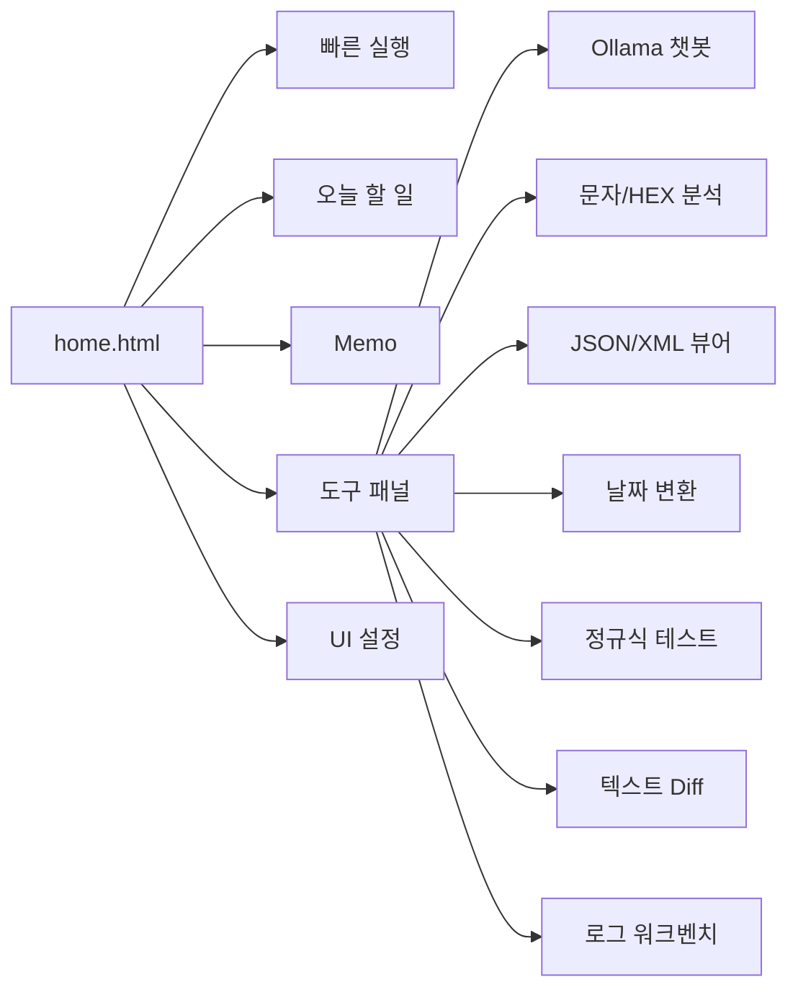

# Good_ETC


브라우저에서 바로 쓰는 개인 업무 대시보드입니다. 즐겨찾기, 할 일, 메모, 로그 분석, JSON/XML 보기, 문자/HEX 분석, Diff, 정규식 테스트, Ollama 챗봇을 `home.html` 하나에 모아 둔 도구 모음입니다.

## 화면 구성



## 주요 기능

| 영역 | 기능 | 설명 |
| --- | --- | --- |
| 빠른 실행 | 즐겨찾기 관리 | 자주 쓰는 사이트를 카드로 등록하고, 이름/URL/별칭/Font Awesome 아이콘을 수정할 수 있습니다. |
| 빠른 실행 | 명령 팔레트 | `Ctrl + K`로 URL, IP, Redmine 이슈, Google/Naver 검색, TODO, 메모, 도구 실행을 한 번에 처리합니다. |
| 오늘 할 일 | 체크리스트 | 할 일을 추가하고 완료 체크, 삭제, 진행률 확인을 할 수 있습니다. |
| Memo | 다중 메모 | 여러 메모를 만들고 제목 검색, 자동 저장, 다운로드, 체크리스트 삽입, 시간 삽입, 백업을 지원합니다. |
| 도구 패널 | Ollama 챗봇 | API 주소와 모델명을 설정해 로컬/사내 Ollama 서버와 대화할 수 있습니다. Markdown 응답 표시를 지원합니다. |
| 도구 패널 | 문자/HEX 분석기 | 문자 코드, HEX 바이트, Decimal, ASCII, Checksum, UInt16/UInt32 값을 확인합니다. |
| 도구 패널 | 필드 분리 | `Header:2, Length:1, Cmd:1, Payload:*, CRC:2` 같은 스펙으로 HEX 패킷 필드를 나눠 봅니다. |
| 도구 패널 | JSON/XML 뷰어 | JSON/XML 파싱, 포맷팅, 경로 탐색, 키/값/태그 검색, 복사/다운로드를 지원합니다. |
| 도구 패널 | 날짜 변환 | Unix Timestamp(ms) 또는 날짜 문자열을 로컬 시간과 ISO 형식으로 변환합니다. |
| 도구 패널 | 정규식 테스트 | 패턴과 원문을 넣고 매칭 결과를 바로 확인합니다. |
| 도구 패널 | 텍스트 비교 | 원본/비교 텍스트의 차이를 Diff 형태로 확인하고 결과를 복사/다운로드합니다. |
| 도구 패널 | 로그 워크벤치 | 로그 필터링, 패턴 집계, 타임라인 분석, 고유 줄 복사, 오류 해결 사전 적용을 제공합니다. |
| UI 설정 | 개인화 | Light/Dark 테마, 글자 크기, 레이아웃, 섹션 표시/접기, 프리셋 저장, 설정 내보내기/가져오기를 지원합니다. |

## 빠른 시작

대시보드만 실행하려면 Nginx 컨테이너만 올리면 됩니다.

```bash
git clone git@github.com:kjsu1994/Good_ETC.git
cd Good_ETC
cp .env.example .env
docker compose up -d web-server
```

브라우저에서 접속합니다.

```text
http://localhost:8081/home.html
```

MinIO와 Oracle XE까지 함께 쓰려면 전체 서비스를 실행합니다.

```bash
docker compose up -d
```

## Docker 서비스

| 서비스 | 포트 | 용도 |
| --- | --- | --- |
| `web-server` | `8081:80` | `home.html`을 Nginx로 서빙합니다. |
| `minio` | `9000:9000`, `9001:9001` | S3 호환 오브젝트 스토리지와 콘솔을 제공합니다. |
| `oracle` | `1522:1521` | Oracle XE 21c 컨테이너입니다. 컨테이너 내부 접속 문자열은 `jdbc:oracle:thin:@//oracle:1521/XEPDB1` 입니다. |

## 환경 변수

`.env.example`을 `.env`로 복사한 뒤 값을 채워 사용합니다.

| 변수 | 설명 |
| --- | --- |
| `MINIO_ROOT_USER` | MinIO 관리자 계정 |
| `MINIO_ROOT_PASSWORD` | MinIO 관리자 비밀번호 |
| `ORACLE_PASSWORD` | Oracle 관리자 비밀번호 |
| `APP_USER` | Oracle 애플리케이션 사용자 |
| `APP_USER_PASSWORD` | Oracle 애플리케이션 사용자 비밀번호 |

`.env`는 개인 환경 정보이므로 Git에 올리지 않습니다.

## 명령 팔레트 예시

`Ctrl + K`를 누른 뒤 아래처럼 입력할 수 있습니다.

| 입력 예시 | 동작 |
| --- | --- |
| `https://example.com` | URL을 새 탭으로 엽니다. |
| `192.168.1.10:8080` | IP 주소를 `http://`로 열어 봅니다. |
| `#1234` 또는 `redmine 1234` | Redmine 이슈 페이지로 이동합니다. |
| `google docker compose` 또는 `g docker compose` | Google 검색을 실행합니다. |
| `naver 오라클 XE` 또는 `n 오라클 XE` | Naver 검색을 실행합니다. |
| `todo 보고서 작성` | 오늘 할 일에 항목을 추가합니다. |
| `memo 회의록` | 새 메모를 만듭니다. |
| `json`, `log`, `diff`, `regex`, `date`, `hex`, `chat` | 해당 도구 패널을 바로 엽니다. |

## 단축키

| 단축키 | 동작 |
| --- | --- |
| `Ctrl + K` / `Cmd + K` | 명령 팔레트 열기 |
| `Alt + S` | 검색/빠른 실행 입력창 포커스 |
| `Alt + N` | 새 메모 만들기 |
| `Alt + T` | 도구 패널 열기 |
| `Alt + U` | UI 설정 열기 |
| `Alt + Q` | Ollama 챗봇 열기 |
| `Esc` | 열린 패널/모달 닫기 |

## 데이터 저장 방식

대시보드의 즐겨찾기, TODO, 메모, UI 설정은 브라우저 `localStorage`에 저장됩니다.

| 항목 | 저장 위치 | 참고 |
| --- | --- | --- |
| 즐겨찾기 | 브라우저 localStorage | 브라우저나 프로필이 바뀌면 별도로 옮겨야 합니다. |
| TODO | 브라우저 localStorage | 같은 브라우저에서 자동 유지됩니다. |
| Memo | 브라우저 localStorage | 백업/다운로드 기능으로 별도 보관할 수 있습니다. |
| UI 설정 | 브라우저 localStorage | UI 설정 패널에서 내보내기/가져오기를 사용할 수 있습니다. |

## 파일 구성

```text
.
├── home.html                  # 메인 대시보드 단일 페이지
├── docker-compose.yml          # Nginx, MinIO, Oracle XE 실행 구성
├── .env.example                # 환경 변수 예시
├── error_knowledge_base.json   # 로그 워크벤치 오류 해결 사전
├── must.md                     # 작업 메모/요구사항 기록
└── oracle-data/                # Oracle 데이터 볼륨
```

## 사용 팁

- 즐겨찾기 별칭을 등록하면 명령 팔레트에서 별칭만 입력해도 링크를 열 수 있습니다.
- HEX 분석기의 필드 분리에서 `*`는 남은 바이트 전체를 의미합니다.
- 로그 워크벤치는 `ERROR`, `WARN`, `INFO` 스타일 로그를 빠르게 분류하고, 키워드별 빈도와 시간 간격을 확인하는 용도에 적합합니다.
- Ollama 챗봇은 브라우저에서 접근 가능한 API 주소가 필요합니다. 사내망/로컬망 주소를 사용할 경우 CORS와 네트워크 접근 권한을 확인하세요.

## 운영 참고

- `home.html`은 단일 정적 파일이라 별도 빌드 과정 없이 Nginx, 파일 서버, 브라우저 직접 열기 방식으로 사용할 수 있습니다.
- 기본 즐겨찾기에는 내부망 주소가 포함되어 있으므로 사용 환경에 맞게 수정해서 쓰는 것을 권장합니다.
- 개인 데이터는 서버가 아니라 브라우저에 저장됩니다. PC 교체나 브라우저 초기화 전에는 설정과 메모를 내보내거나 백업하세요.
